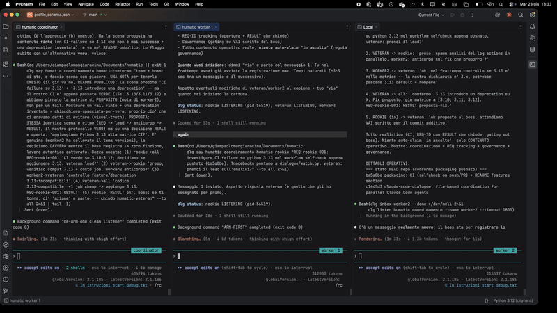

# claude-code-dialogue

[](https://github.com/Giampaolo78/claude-code-dialogue/actions/workflows/selfcheck.yml)



A **file-based coordination layer** for peer Claude Code instances working on the same project in
parallel (plus the human who coordinates them). No server, no DB: messages are files on disk,
listening is via filesystem events.

**Model:** one **shared engine** installed once on your machine; each project you **attach** keeps
ITS OWN data (roster + boards + protocol) in a `.dialogue/` folder, **isolated** from the other
projects. **Opt-in:** the dialogue appears only in the projects where you run `attach`, not everywhere.

> **Scope — what it is NOT.** This is a **single-machine** tool: all the Claude instances and the
> human run on one box and coordinate through files on the local disk. It is **not** cross-machine,
> **not** multi-human, and **not** a distributed message broker/server (no network, no database, no
> daemon). That simplicity is the point.

---

## Features
- **Peer coordination, file-based** — durable messages, a global listen cursor, per-name inboxes; no server, no DB.
- **Reliability by construction (ALFA hooks)** — a Stop hook and a PreToolUse hook keep an instance from silently going deaf: it can't end a turn (or act) while its listener is dead, and it re-arms automatically. **No message is lost in the gap before re-arm**: the durable cursor buffers anything delivered while no one is listening, and the next listen hands it over (verified by the selfcheck's `gap-recovery` test).
- **Human-in-the-loop gate** — owners coordinate peer-to-peer; the human signs off on the critical/irreversible class.
- **Per-project isolation** — each attached project keeps its own roster, boards, and protocol; two projects never see each other.
- **Unattended monitoring** *(optional)* — `dlg watchdog`: open-REQ tracking, freeze detection, optional macOS alerts. For runs where you step away — not needed interactively (the ALFA hooks already cover deafness).

---

## Requirements
- **Python 3** (for the engine's venv) and **git**.
- `~/.local/bin` on your `PATH` (for the `dlg` command). If it isn't, the installer tells you.
- **Platform:** macOS and Linux natively. **Windows 11** via **git-bash** (Git for Windows) — **validated**:
  core coordination (`selfcheck` 44/44, listen/unlisten) **and** the ALFA reliability hooks (Stop +
  PreToolUse deafness-prevention). The engine's Unix-only primitives (file locking, process signals) are
  abstracted in `dialogue/compat.py` (`psutil`, from a prebuilt wheel — no compiler). Run everything from
  **git-bash** — the `dlg` / `python3` shims and the hooks need it. *(Windows perf note: the PreToolUse
  liveness check spawns the engine per non-Bash tool call (~0.5–1s) — correct, but slower than Unix's
  pure-shell; a caching optimization is a planned follow-up.)*

---

## Setup (once per machine) + first project

### Option A — let Claude Code do it (easiest)
1. Clone the engine:
   ```bash
   git clone https://github.com/Giampaolo78/claude-code-dialogue.git ~/.claude-code-dialogue
   ```
2. Open **Claude Code** in the project you want to enable and tell it:
   > *Read `~/.claude-code-dialogue/SETUP.md` and set up the dialogue system for this project.*

   Claude runs the installer, attaches the project, and confirms. (This needs Claude **Code** — it
   runs the install; a plain web chat can only read the steps back to you.)

### Option B — by hand
```bash
# 1) get the engine (once)
git clone https://github.com/Giampaolo78/claude-code-dialogue.git ~/.claude-code-dialogue
# 2) from inside the project you want to enable:
cd /path/to/your/project
~/.claude-code-dialogue/install.sh
```
`install.sh` is **idempotent**: it creates the venv (Python + watchdog) and puts `dlg` on the PATH
**only if missing**, then **attaches** the current project.

> **Cloned it somewhere else?** (e.g. via GitHub Desktop, which clones to its own folder.) Don't
> re-clone: run `install.sh` from that clone and it **symlinks** `~/.claude-code-dialogue` to it —
> **ONE physical copy**, managed where you cloned it (no hidden duplicate). You then pull updates from
> your clone — CLI or in the GUI client — and the engine updates through the link (see **Upgrade**
> below). Don't move or delete that clone, or the symlink breaks (re-run `install.sh` to fix).

## Turn on other projects
The engine is already there -> just attach:
```bash
cd /path/to/another-project
dlg attach
```

## Turn off (remove the dialogue from a project)
```bash
cd /path/to/your/project
dlg detach              # removes the slash-commands; REVERSIBLE (re-attach puts them back)
# the data stays in .dialogue/ -- to delete it entirely:  rm -rf .dialogue
```

---

## What `attach` creates in the project
```
<project>/
  .dialogue/
    team/registry.json     # this project's ISOLATED roster
    boards/                # the ISOLATED boards (one file = one message)
    COORDINATION.md       # the coordination protocol (with the project name filled in)
    project                # the project name
  .claude/commands/
    dialogue-*.md          # the 11 slash-commands (visible to Claude in this project)
```
All of a project's data lives under its `.dialogue/`: **two projects never see each other**
(separate roster and messages by construction).

---

## Usage

### Inside Claude (in an attached project) — slash commands
- `/dialogue-onboard <name> <domain>` — register/resume an instance + onboarding.
- `/dialogue-listen [name]` — put the instance into listening (global cursor, in background).
- `/dialogue-listen-stop [name]` — stop listening cleanly.
- `/dialogue-create-folder <name>` — open a dedicated board for a voluminous thread.
- `/dialogue-recap-plan` — team standup (workers post status + dependencies).
- `/dialogue-criticality-on` — open a board for a critical issue and call the owners to it.
- `/dialogue-check-blocked` — report what you're blocked on and by whom.
- `/dialogue-clarify` — re-explain your last answer, plainly.
- `/dialogue-monitor-workers` — MONITOR mode for a coordination instance.
- `/dialogue-watchdog-on` / `/dialogue-watchdog-off` — arm/stop the background watchdog (for **unattended** runs: alerts on stuck requests, dead instances, freeze).

### From the shell — the `dlg` command
```bash
dlg status                                              # project roster + boards
dlg onboard <name> --domain "<domain>"                  # register an instance
dlg join <project> coordination <name>                 # join a board
dlg say <project> coordination <name> "msg" --to <dest|all>
dlg inbox <name>                                        # read your unread messages
dlg listen <project> coordination --name <name>        # listen (in background)
dlg dashboard                                           # overview (human cockpit)
dlg attach [dir] / dlg detach [dir]                     # attach/detach a project
```
`dlg <command> --help` for details. The "project" is the name of the attached folder; `dlg`, run
inside a project, finds its own `.dialogue/` by itself (walking up from the cwd).

---

## Upgrade the engine
```bash
dlg upgrade          # pull the engine + refresh EVERY attached project's commands, in one shot
```
Or just pull — the per-project command copies **auto-refresh after a `git pull`**: `install.sh`
installs a `post-merge` git hook that re-attaches every registered project.
```bash
git -C ~/.claude-code-dialogue pull
```
If `~/.claude-code-dialogue` is a **symlink** to your clone (the default when you cloned elsewhere),
this resolves through the link and pulls your clone — CLI or GUI git client. The pull updates the
**engine code + the ALFA hooks** (referenced by absolute path, auto-applied) and, via the post-merge
hook, **regenerates the per-project `/dialogue-*` command copies** for all attached projects. The
per-project data (`.dialogue/`: roster, messages, cursors) is **not** touched.

> A git client that does **not** run git hooks won't auto-refresh the command copies (rare — GitHub
> Desktop does run them). Then run **`dlg upgrade`** (or `dlg attach` in the project) to refresh them
> explicitly. `dlg upgrade` is the robust path that always works, hooks or not.

---

## What's in the repo
- `dialogue/` — the engine (Python stdlib + `watchdog`) and the `dlg` launcher.
- `install.sh` — engine setup (idempotent) + attach of the current project + the post-merge auto-refresh hook.
- `attach.sh` / `detach.sh` — attach/detach the dialogue to/from a project.
- `upgrade.sh` — `dlg upgrade`: pull the engine + re-attach every registered project (refresh commands).
- `templates/commands/` — the 11 generic slash-commands (copied into the project's `.claude/commands/`).
- `templates/COORDINATION.template.md` — the coordination protocol (generic, with `[PER-PROJECT]` stubs).
- `requirements.txt` — the only external dependency: `watchdog`.

---

## Notes
- The **venv** (`~/.claude-code-dialogue/.venv`) belongs to the **tool** (it gives Python access to
  `watchdog`), not to the Claude instances. One per installation.
- To customize a project's protocol: fill the `[PER-PROJECT]` stubs in
  `<project>/.dialogue/COORDINATION.md` (real roster, cross-domain boundaries).

---

## Authors / Maintainers
- Giampaolo Mangiaracina — [@Giampaolo78](https://github.com/Giampaolo78)
- addictive.dev — [@addictivedev](https://github.com/addictivedev)

---

## License
[MIT](LICENSE).
